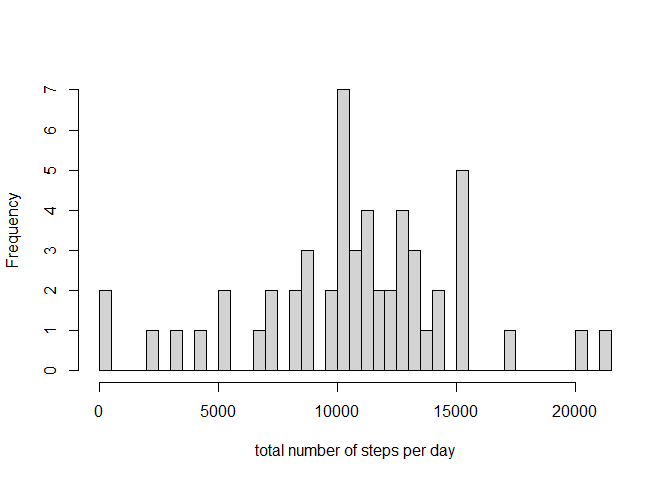
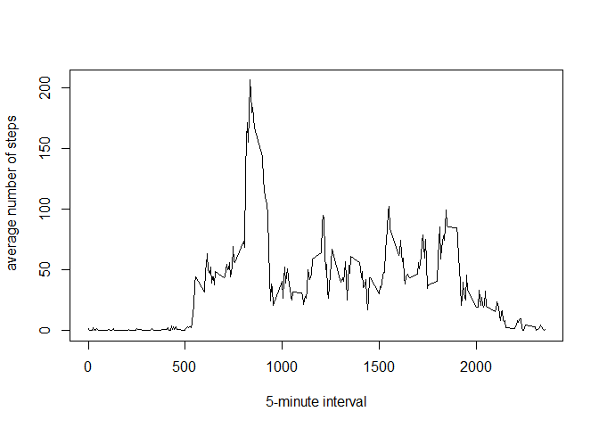
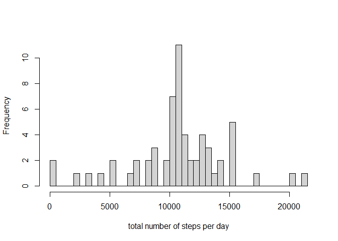
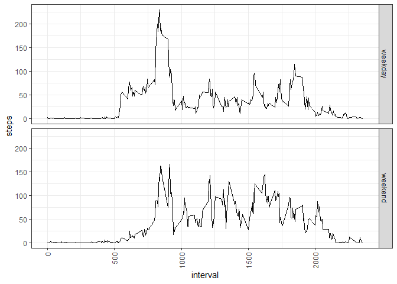

## Loading and preprocessing the data


```r
options(warn=-1)
setwd('D:/RStudio')
df <- read.csv('./repdata_data_activity/activity.csv')
df$date <- as.Date(df$date)
```

## What is mean total number of steps taken per day?


```r
df1 <- df[!is.na(df$steps),]
totalSteps <- aggregate(df1$steps, list(df1$date), FUN=sum)
hist(totalSteps$x, breaks=dim(totalSteps)[1], xlab='total number of steps per day', main='')
```

<!-- -->

Mean


```r
mean(totalSteps$x)
```

```
## [1] 10766.19
```

Median


```r
median(totalSteps$x)
```

```
## [1] 10765
```

## What is the average daily activity pattern?


```r
meanSteps <- aggregate(df1$steps, list(df1$interval), FUN=mean)
plot(meanSteps[,1], meanSteps[,2], type='l', xlab='5-minute interval', ylab='
       average number of steps')
```

<!-- -->

5-minute interval that contains the maximum number of steps

```r
meanSteps[which.max(meanSteps$x),1]
```

```
## [1] 835
```

## Imputing missing values

impute missing values with the mean for that 5-minute interval

```r
dim(df[is.na(df$steps),])[1]
```

```
## [1] 2304
```

```r
j = 0
for (i in 1:dim(df)[1]){
  if (is.na(df[i,1])){
    df[i,1] = meanSteps[meanSteps$Group.1 == df[i,3],2]
    j = j + 1
  }
}
totalSteps2 <- aggregate(df$steps, list(df$date), FUN=sum)
hist(totalSteps2$x, breaks=dim(totalSteps2)[1], xlab='total number of steps per day', main='')
```

<!-- -->

Mean


```r
mean(totalSteps2$x)
```

```
## [1] 10766.19
```

Median


```r
median(totalSteps2$x)
```

```
## [1] 10766.19
```

## Are there differences in activity patterns between weekdays and weekends?


```r
df$week <- 'weekday'
for (i in 1:dim(df)[1]){
  if (weekdays(df[i,2]) == '星期日' | weekdays(df[i,2]) == '星期六'){
    df$week[i] = 'weekend'
  }
}
df$week <- as.factor(df$week)
meanSteps2 <- aggregate(df$steps, list(df$interval, df$week), FUN=mean)
colnames(meanSteps2) <- c('interval', 'week', 'steps')
library(ggplot2)
g <- ggplot(meanSteps2, aes(interval, steps))
g + geom_line() + 
  facet_grid(week~.)+
  theme_bw(base_family = 'Times') +
  theme(axis.text.x = element_text(angle = 90, vjust = 0.5, hjust=1))
```

<!-- -->
